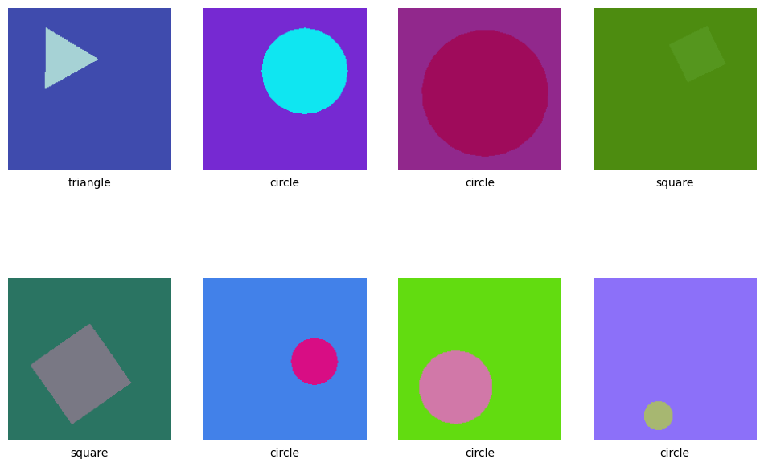
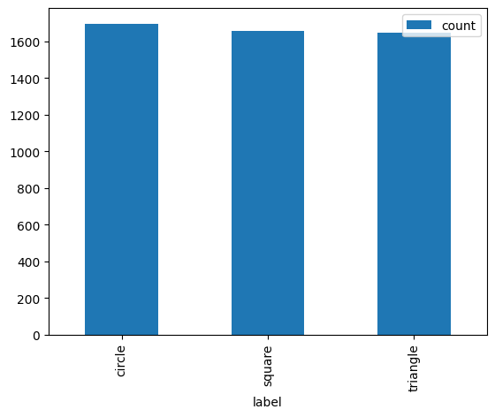
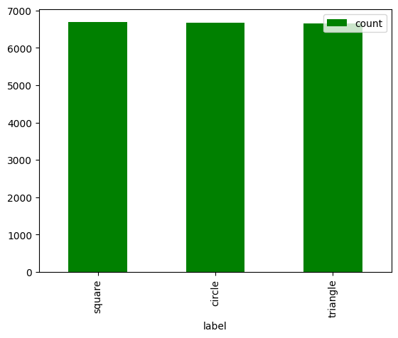
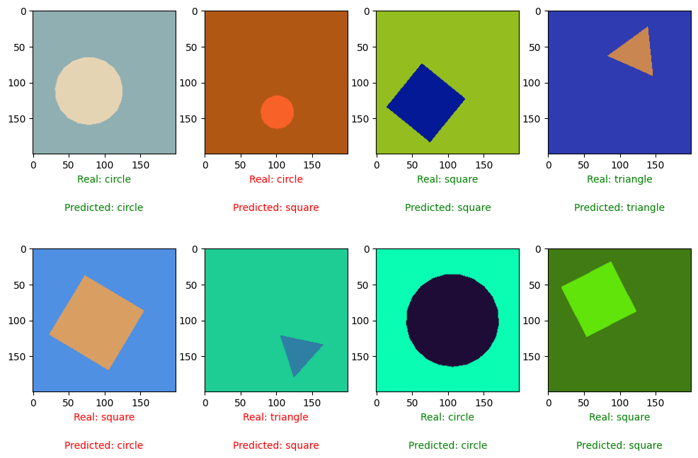
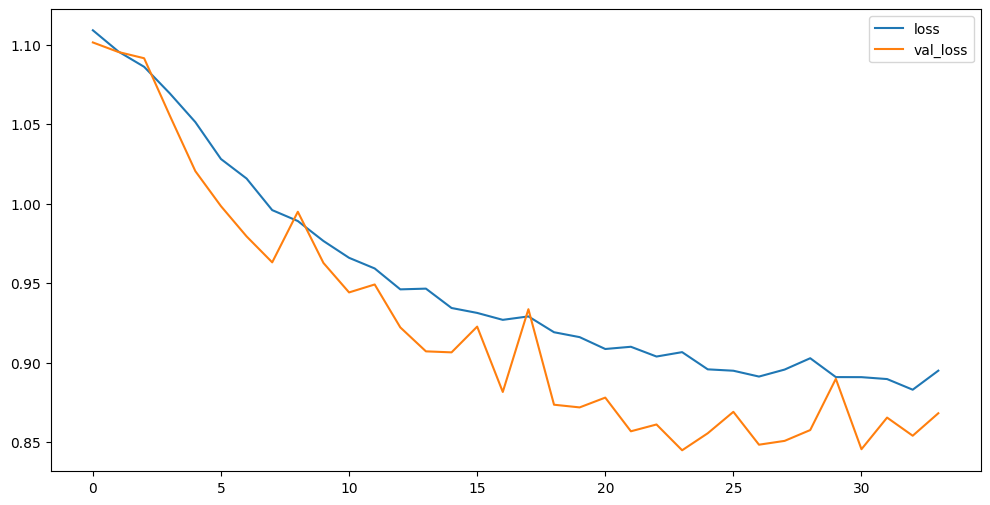
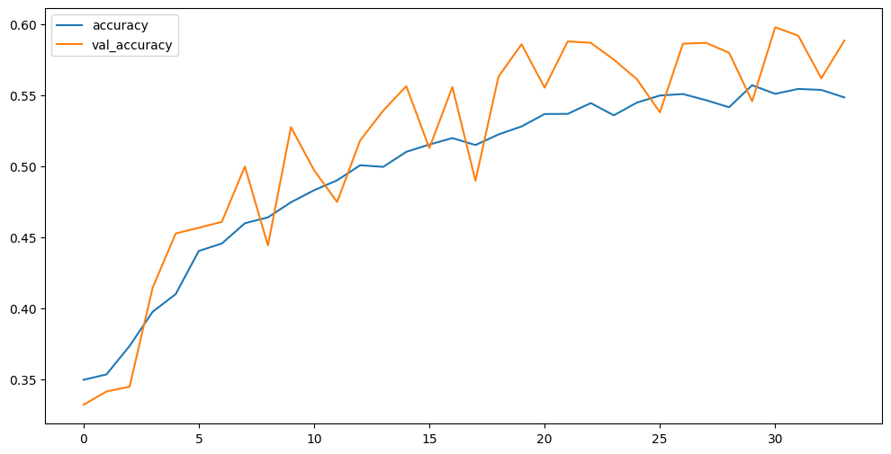

# Geometric Forms Visualization

This project is a Jupyter Notebook that demonstrates how to visualize and analyze basic geometric shapes using Python. It's ideal for students, educators, and enthusiasts who want to understand geometry through code and visualization.

## Features
 
- Plotting geometric shapes using `matplotlib`
- Use of `numpy` for precise point generation and transformation
- Visual demonstration of:
  - Circles
  - Ellipses
  - Rectangles
  - Polygons
- Customization of shape parameters (size, color, position)
- Code written for clarity and educational use

## Technologies Used

- Python 3.x
- Jupyter Notebook
- Matplotlib
- NumPy

## Getting Started

### Prerequisites
Make sure you have the following installed:
- Python (>=3.7)
- Jupyter Notebook or JupyterLab
- `matplotlib`
- `numpy`

You can install the dependencies using pip:
```bash
pip install matplotlib numpy
```

## **Run the Notebook**
1. **Clone the repository**
   ```bash
   git clone https://github.com/your-username/geometric_forms.git
   cd geometric_forms
   ```

2. **Start the notebook:**
   ```bash
   jupyter notebook geometric_forms.ipynb
   ```
## Use Cases
 - Geometry teaching and learning
 - Basic computer graphics demonstrations
 - Data visualization practice

## Example Output








